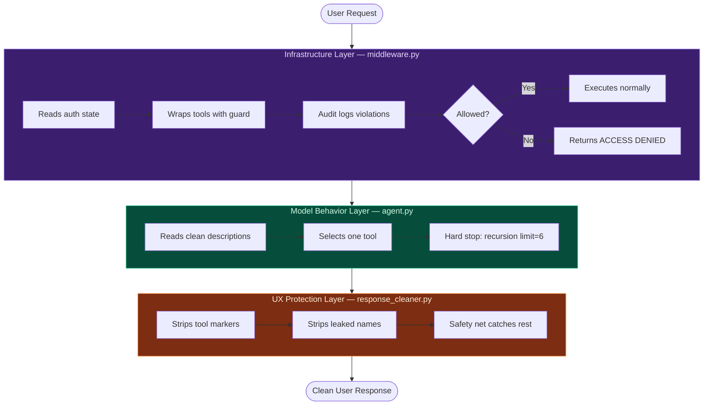

# System Architecture

## Overview

This system implements a **layered access control architecture** for AI agents.
The core principle: infrastructure enforces permissions, models handle reasoning.
Never rely on a model to enforce what infrastructure should enforce.

---

## The Three Layers




---

## Tool Access Policy

| User State                        | public_search | private_search | advanced_search |
|-----------------------------------|:---:|:---:|:---:|
| Unauthenticated                   | ✅  | ❌  | ❌  |
| Authenticated, < 5 messages       | ✅  | ✅  | ❌  |
| Authenticated, 5+ messages        | ✅  | ✅  | ✅  |

---

## Why Tool Names Never Change

LangChain builds an internal `{tool_name: function}` registry at `create_agent()` time.

**Wrong approach (what we tried first):**
```python
# Renaming tools in middleware breaks the registry
locked = StructuredTool(name="LOCKED_private_search", ...)
# → ValueError: Unknown tools: ['LOCKED_private_search']
```

**Correct approach:**
```python
# Wrap the function, keep the name
def guarded_fn(query):
    if tool_name not in allowed_names:
        return "__ACCESS_DENIED__"
    return original_fn(query)

locked = StructuredTool(name="private_search", func=guarded_fn, ...)
# → Registry intact, enforcement intact
```

This is the **Open/Closed Principle**: enforce policy inside the contract,
never by breaking the interface.

---

## Why All 3 Tools Are Always Passed to Groq

Groq rejects specific 2-tool schema combinations (provider-level bug):
- `[public_search]` alone → works ✅
- `[public_search, private_search]` → `BadRequestError` ❌
- `[public_search, private_search, advanced_search]` → works ✅

Solution: always pass all 3 tools. Access control lives in the guarded
functions, not in which tools Groq receives.

---

## Evaluation Architecture

```
4 Independent Metrics — each catches a different failure class:

Tool Selection Accuracy
  Did the model pick the correct tool for the query?
  Failure class: model behavior / description ambiguity

Block Enforcement
  Did infrastructure prevent disallowed tool execution?
  Failure class: middleware policy logic

Loop-Free Rate
  Did the model stop after one tool call?
  Failure class: circuit breaker calibration

UX Quality
  Does the user response contain any internal system language?
  Failure class: UX layer / prompt engineering
```

A combined score would hide which layer failed.
Independent metrics tell you exactly where to look.
